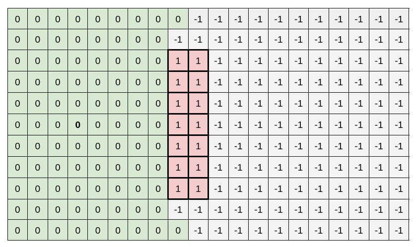

## **What Is This?**

This demo creates and runs a ROS 2 **node**, `dummy_map_server`, that publishes `nav_msgs::msg::OccupancyGrid` on a ROS 2 publisher topic, `/map`.

**dummy_map_server** is also a dependency of **dummy_robot_bringup**.

Please refer to [dummy_robot_bringup](https://github.com/ros2/demos/tree/rolling/dummy_robot/dummy_robot_bringup).

## **What Is An Occupancy Grid?**

An occupancy grid can be thought of as a map of an environment that has been divided into grid cells, where each grid cell is either occupied or unoccupied (in advanced applications, they can have other states, too).

This map of occupied and unoccupied grid cells can be used to help a robot navigate a space, for example to drive through a room with furniture.

If a robot is navigating a new room, however, there may also be grid cells that are marked as unknown, until that area is explored.

These different states are often stored in the occupancy grid as integers, for example:

:warning: Note that the integer within a cell is application-specific and can go beyond `-1` and `1`.


`-1` represents **unknown** spaces.
`0` represents **unoccupied** spaces.
`1` represents **occupied** spaces.

The illustration above shows an example of an occupancy grid where the **bolded integer** indicates the position of a robot with a lidar sensor mounted on top of it and the red-colored grid cells indicate an obstacle such as a wall.

## **Build**

```bash
colcon build --packages-up-to dummy_map_server
```

## **Run**

```bash
ros2 run dummy_map_server dummy_map_server
```

## **Verify**

A similar terminal output should be seen after running `ros2 run dummy_map_server` and the following commands:

```bash
ros2 topic echo /map
```


```bash
# Terminal Output
header:
  stamp:
    sec: 1658559453
    nanosec: 308405010
  frame_id: world
info:
  map_load_time:
    sec: 0
    nanosec: 0
  resolution: 0.10000000149011612
  width: 100
  height: 100
  origin:
    position:
      x: -5.0
      y: -5.0
      z: 0.0
    orientation:
      x: 0.0
      y: 0.0
      z: 0.0
      w: 1.0
data:
- -1
- -1
- -1
- -1
- -1
- -1
- -1
- -1
- -1
- '...'
---

```

## **References**

- `nav_msgs::msg::OccupancyGrid` Message Format: https://github.com/ros2/common_interfaces/blob/rolling/nav_msgs/msg/OccupancyGrid.msg
