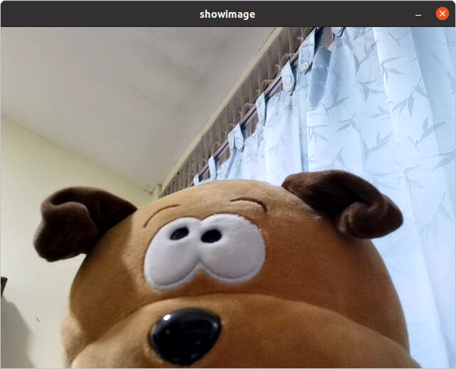

## **What Is This?**

This demo provides simple utilities to connect to a workstation default camera device and display it in a window like below:



## **Build**

```bash
colcon build --packages-select image_tools
```

## **Run**

In `image_tools` ROS 2 package, two executables are provided, namely `cam2image` and `showimage` with different functions.

## **1 - cam2image**
Running this executable connects to your workstation's default camera device's video stream and publishes the images on '/image' and '/flipimage' topics using a ROS 2 publisher.

```bash
# Open new terminal
ros2 run image_tools cam2image
```

Note that `cam2image` provides many useful command-line options. Run `ros2 run image_tools cam2image --help` to see the list of options available.
>
> Eg. If a camera device is not available, run `ros2 run image_tools cam2image --ros-args -p burger_mode:=true`.

## **2 - showimage**
Running this executable creates a ROS 2 node, `showimage`, which subscribes to the `sensor_msg/msg/Image` topic, `/image` and displays the images in a window.

```bash
# Open new terminal
# Run showimage ROS 2 node to display the cam2image sensor_msg/msg/Image messages.
ros2 run image_tools showimage
```
