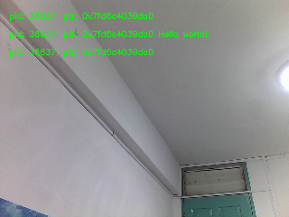
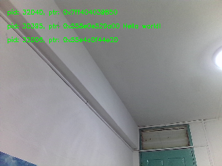
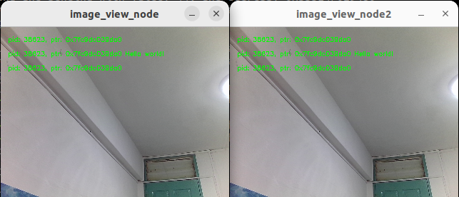

## What Is This?

The demos in this package are designed to showcase how developers can **manually compose ROS 2 nodes** by **defining them separately** but **combining them in varied process layouts**.

These can be done while avoiding code overhauls or performance restrictions.

This package consists of the following ROS 2 nodes:

1. `camera_node`
2. `watermark_node`
3. `image_view_node`
4. `image_pipeline_all_in_one`
5. `two_node_pipeline`
6. `cyclic_pipeline`
7. `image_pipeline_with_two_image_view`

Through the use of **intra-process** (as opposed to **inter-process**) node communication, lower latency and thus **higher efficiency** is observed for ROS 2 topologies that utilizes this manner of communication.

The improvements in latency reduction are even **more pronounced when applied to ROS 2 systems with more complex topologies**.

## Build

```bash
colcon build --packages-up-to intra_process_demo
```

## Run

### 1. Two Node Pipeline

Run `two_node_pipeline` via the commands below:

```bash
ros2 run intra_process_demo two_node_pipeline
```

> This sets up two nodes, a ROS 2 node that publishes a string with an incremeting integer value, as well as a ROS 2 node that subscribes to print the received string.


### 2. Cyclic Pipeline

Run `cyclic_pipeline` via the commands below:

```bash
ros2 run intra_process_demo cyclic_pipeline
```

> Similar to the previous, instead of creating a new message for each new iteration, the publisher and subscriber nodes only ever use one message instance. This is achieved by having a cycle in the graph and kickstarting the communication externally by having one of the nodes publish before spinning the executor.

### 3. Image Pipeline All In One

Please ensure you have a camera connected to your workstation.

`image_pipeline_all_in_one` consists of **3** nodes, where `camera_node` publishes a `unique_ptr` message onto the topic, `\image`. Subsequently,  `watermark_node` subscribes to the previous, republishes the image after adding a watermark on the topic, `\watermarked_image`, and the final node, `image_view_node`, subscribes to this last topic in order to display it for user.

```bash
ros2 run intra_process_demo image_pipeline_all_in_one
```


### 4. Image Pipeline All Separately

Please ensure you have a camera connected to your workstation.

**In direct contrast with the previous**, run the following commands in separate terminals to have `camera_node`, `watermark_node` and `image_view_node` all in their own process, utilizing **inter-process node communication**.

This starts the `camera_node` ROS 2 node and publishes images captured from your workstation web camera onto a ROS 2 topic labelled `/image`.
```bash
# Open new terminal
ros2 run intra_process_demo camera_node
```

This starts the `watermark_node` ROS 2 node which subscribes to raw images from ROS 2 topic `/image`, overlays both **process ID number** and **message address** on top of the image visually and publishes to ROS 2 topic `/watermarked_image`.
```bash
# Open new terminal
ros2 run intra_process_demo watermark_node
```

This starts the `image_view_node` ROS 2 node which subscribes to `/watermarked_image` and displays the received images in an OpenCV GUI window.

```bash
# Open new terminal
ros2 run intra_process_demo image_view_node
```

### 5. Image Pipeline With Two Image Views

Please ensure you have a camera connected to your workstation.

Similar to the **Image Pipeline All In One**, running `image_pipeline_with_two_image_view` will display the image process through intra-process communications.

However, it now instantiates 2 `image_view_node` ROS 2 nodes.

```bash
# Open new terminal
ros2 run intra_process_demo image_pipeline_with_two_image_view
```


## Verify

### 1. Two Node Pipeline

When executed correctly, strings should be printed in the terminal similar to what is shown below:

```bash
Published message with value: 0, and address: 0x55B68BCC6F20
 Received message with value: 0, and address: 0x55B68BCC6F20
Published message with value: 1, and address: 0x55B68BCC6F20
 Received message with value: 1, and address: 0x55B68BCC6F20
Published message with value: 2, and address: 0x55B68BCC6F20
 Received message with value: 2, and address: 0x55B68BCC6F20
Published message with value: 3, and address: 0x55B68BCC6F20
 Received message with value: 3, and address: 0x55B68BCC6F20
```

### 2. Cyclic Pipeline

When executed correctly, strings should be printed in the terminal similar to what is shown below:

```bash
Published first message with value:  42, and address: 0x555E4F029480
Received message with value:         42, and address: 0x555E4F029480
  sleeping for 1 second...
  done.
Incrementing and sending with value: 43, and address: 0x555E4F029480
Received message with value:         43, and address: 0x555E4F029480
  sleeping for 1 second...
  done.
Incrementing and sending with value: 44, and address: 0x555E4F029480
Received message with value:         44, and address: 0x555E4F029480
  sleeping for 1 second...
  done.
Incrementing and sending with value: 45, and address: 0x555E4F029480
Received message with value:         45, and address: 0x555E4F029480
  sleeping for 1 second...

```

### 3. Image Pipeline All In One

When executed correctly, an OpenCV GUI window should appear displaying something similar to what is shown below:



>Take note how the **process_id** and **Message Pointer Address** are **all the same**, proving that all 3 nodes are in the same process.

### 4. Image Pipleline All Separately

When executed correctly, an OpenCV GUI window should appear displaying something similar to what is shown below:



> Notice how all the **process_id** and **Message Pointer Address** are now **all different**, showing that all nodes are using different processes.

### 5. Image Pipeline With Two Image Views

When executed correctly, 2 OpenCV GUI window should appear displaying similar to what is show below:



> For more details on this implementations, please refer to the references below.

## References

1. [Intra Process Communication tutorial](https://docs.ros.org/en/rolling/Tutorials/Demos/Intra-Process-Communication.html)
2. [Intra-process Communications in ROS 2](https://design.ros2.org/articles/intraprocess_communications.html)
